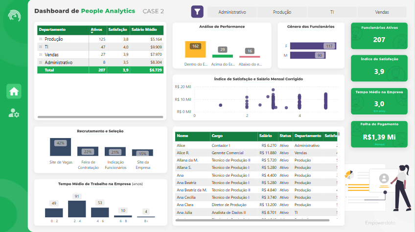
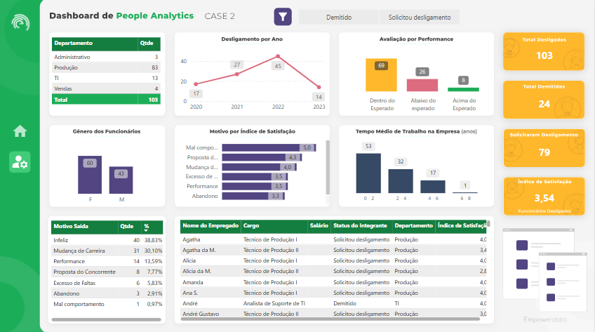

# People Analytics

## Relatório Power BI

Acesse o link: [Power BI](https://app.powerbi.com/reportEmbed?reportId=c3eb0cfc-6b64-4fd9-8b73-7e357e0b9021&autoAuth=true&ctid=7ebef80c-1027-4129-b484-ccf2bd3fd58f)

---

## Relatório Excel
							

												

			

											

[Excel](excel/people_analytics.xlsx)

